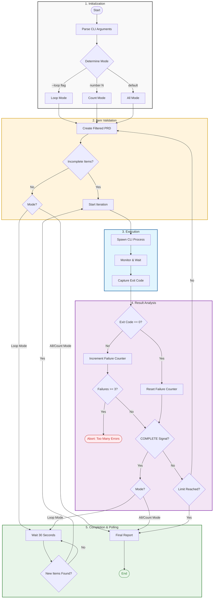

# Run Command State Machine

```mermaid
flowchart TD
    subgraph Initialization ["1. Initialization"]
        Start([Start]) --> ParseArgs[Parse CLI Arguments]
        ParseArgs --> ModeSelect{Determine Mode}

        ModeSelect -- "--loop flag" --> LoopMode[Loop Mode]
        ModeSelect -- "number N" --> CountMode[Count Mode]
        ModeSelect -- "default" --> AllMode[All Mode]
    end

    subgraph Validation ["2. Item Validation"]
        CreateFilteredPRD[Create Filtered PRD] --> HasIncomplete{Incomplete Items?}

        HasIncomplete -- "Yes" --> StartIteration
        HasIncomplete -- "No" --> ModeCheck
    end

    subgraph Execution ["3. Execution"]
        StartIteration[Start Iteration] --> SpawnProcess[Spawn CLI Process]
        SpawnProcess --> MonitorProcess[Monitor & Wait]
        MonitorProcess --> CaptureResult[Capture Exit Code]
    end

    subgraph Analysis ["4. Result Analysis"]
        ExitCheck{Exit Code == 0?}

        ExitCheck -- "No" --> FailurePath[Increment Failure Counter]
        FailurePath --> CriticalCheck{Failures >= 3?}
        CriticalCheck -- "Yes" --> Abort([Abort: Too Many Errors])
        CriticalCheck -- "No" --> SignalCheck

        ExitCheck -- "Yes" --> SuccessPath[Reset Failure Counter]
        SuccessPath --> SignalCheck

        SignalCheck{COMPLETE Signal?}
        SignalCheck -- "Yes" --> CompleteModeCheck
        SignalCheck -- "No" --> IterationCheck
    end

    subgraph Completion ["5. Completion & Polling"]
        ModeCheck{Mode?}
        ModeCheck -- "Loop Mode" --> PollWait
        ModeCheck -- "All/Count Mode" --> FinalReport

        CompleteModeCheck{Mode?}
        CompleteModeCheck -- "Loop Mode" --> PollWait[Wait 30 Seconds]
        CompleteModeCheck -- "All/Count Mode" --> FinalReport[Final Report]

        PollWait --> CheckNewItems{New Items Found?}
        CheckNewItems -- "Yes" --> StartIteration
        CheckNewItems -- "No" --> PollWait

        FinalReport --> End([End])

        IterationCheck{Limit Reached?}
        IterationCheck -- "Yes" --> FinalReport
        IterationCheck -- "No" --> CreateFilteredPRD
    end

    %% Cross-subgraph connections
    LoopMode --> CreateFilteredPRD
    CountMode --> CreateFilteredPRD
    AllMode --> CreateFilteredPRD
    CaptureResult --> ExitCheck

    %% Styling
    style Initialization fill:#f9f9f9,stroke:#333,stroke-width:2px
    style Validation fill:#fff4dd,stroke:#d4a017,stroke-width:2px
    style Execution fill:#e1f5fe,stroke:#01579b,stroke-width:2px
    style Analysis fill:#f3e5f5,stroke:#7b1fa2,stroke-width:2px
    style Completion fill:#e8f5e9,stroke:#2e7d32,stroke-width:2px
    style Abort fill:#ffebee,stroke:#c62828,color:#c62828
    style End fill:#e8f5e9,stroke:#2e7d32,color:#2e7d32
```
