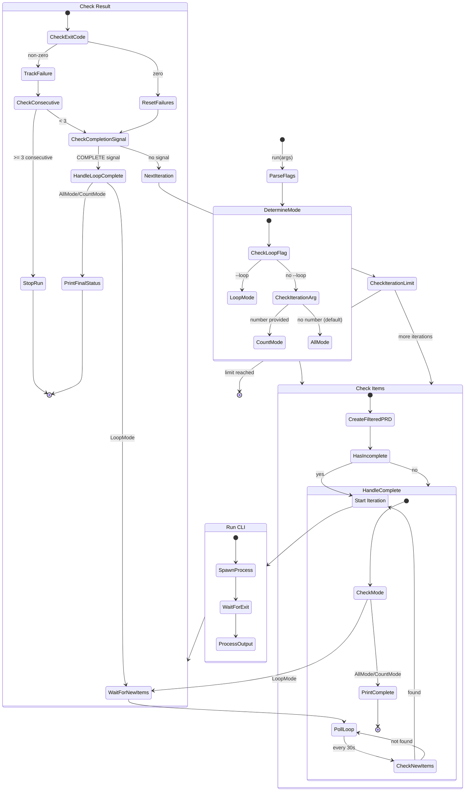

# Run Command State Machine

```mermaid
stateDiagram-v2
    [*] --> ParseFlags : run(args)

    ParseFlags --> DetermineMode

    state DetermineMode {
        [*] --> CheckLoopFlag
        CheckLoopFlag --> LoopMode : --loop
        CheckLoopFlag --> CheckIterationArg : no --loop
        CheckIterationArg --> CountMode : number provided
        CheckIterationArg --> AllMode : no number (default)
    }

    DetermineMode --> CheckItems

    state "Check Items" as CheckItems {
        [*] --> CreateFilteredPRD
        CreateFilteredPRD --> HasIncomplete
        HasIncomplete --> StartIteration : yes
        HasIncomplete --> HandleComplete : no
    }

    state HandleComplete {
        [*] --> CheckMode
        CheckMode --> WaitForNewItems : LoopMode
        CheckMode --> PrintComplete : AllMode/CountMode
        WaitForNewItems --> PollLoop
        PollLoop --> CheckNewItems : every 30s
        CheckNewItems --> StartIteration : found
        CheckNewItems --> PollLoop : not found
        PrintComplete --> [*]
    }

    state "Start Iteration" as StartIteration

    StartIteration --> RunCLI

    state "Run CLI" as RunCLI {
        [*] --> SpawnProcess
        SpawnProcess --> WaitForExit
        WaitForExit --> ProcessOutput
    }

    RunCLI --> CheckResult

    state "Check Result" as CheckResult {
        [*] --> CheckExitCode
        CheckExitCode --> TrackFailure : non-zero
        CheckExitCode --> ResetFailures : zero
        TrackFailure --> CheckConsecutive
        CheckConsecutive --> StopRun : >= 3 consecutive
        CheckConsecutive --> CheckCompletionSignal : < 3
        ResetFailures --> CheckCompletionSignal
        CheckCompletionSignal --> HandleLoopComplete : COMPLETE signal
        CheckCompletionSignal --> NextIteration : no signal
        HandleLoopComplete --> WaitForNewItems : LoopMode
        HandleLoopComplete --> PrintFinalStatus : AllMode/CountMode
        StopRun --> [*]
        PrintFinalStatus --> [*]
    }

    NextIteration --> CheckIterationLimit
    CheckIterationLimit --> CheckItems : more iterations
    CheckIterationLimit --> [*] : limit reached
```
